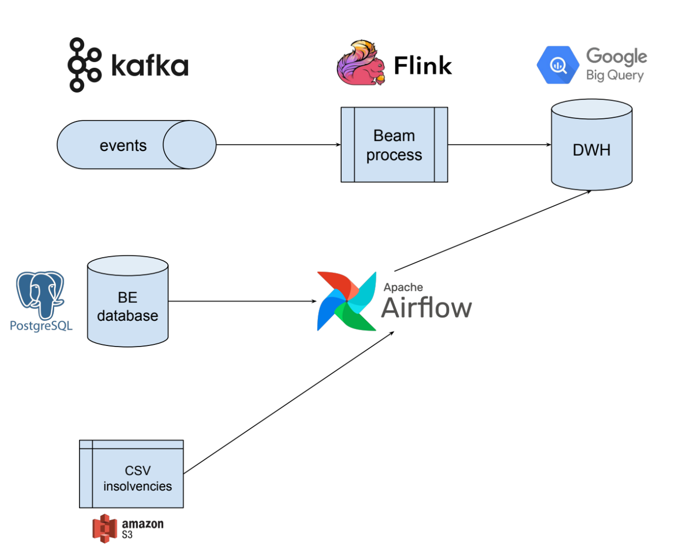
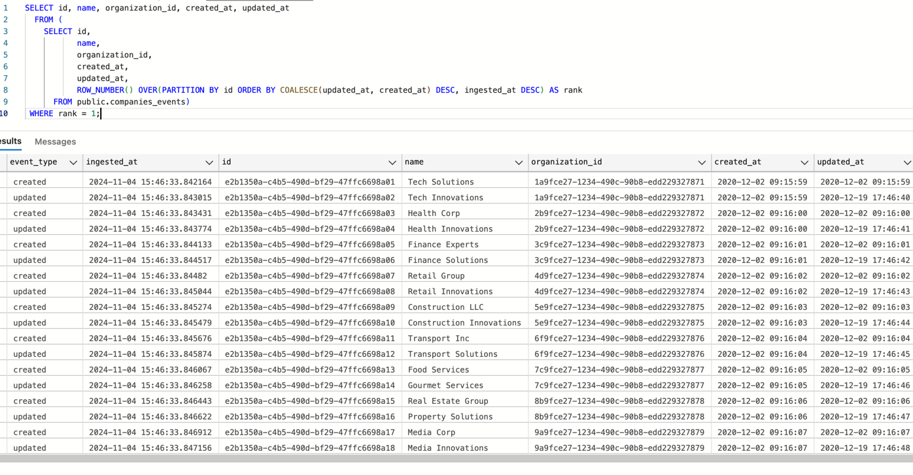

# [Skill Test] Data Engineer

- [Understanding](#understanding)
- [Short term plan](#short-term-plan)
  - [BE Postgres database](#be-postgres-database)
  - [CSV insolvencies](#csv-insolvencies)
  - [Kafka companies events](#kafka-companies-events)
- [Mid/Long term plan](#midlong-term-plan)
- [Implementation](#implementation)
  - [Why did I change the events in the events.json file?](#why-did-i-change-the-events-in-the-eventsjson-file)
  - [How to check the code?](#how-to-check-the-code)
  - [Limits of the current code/solution](#limits-of-the-current-codesolution)
  - [How I would get the latest data in the db?](#how-i-would-get-the-latest-data-in-the-db)
- [SQL Questions](#sql-questions)

## Understanding

The goal is to fill a data warehouse with different data sources.
As I have no intel on the data warehouse setup, I will assume I have to start from scratch.

I will also assume that I have the following data stack ready to use:
- An empty SQL data warehouse like BigQuery (could be Snowflake, Redshift, etc.)
- A scheduler like Apache Airflow
- A beam runner like Apache Flink or Google Dataflow

Knowing that, I have the following data sources available, 
and I want to keep the data up-to-date in the data warehouse, as fresh as possible:
- Some tables in a Postgres database (on the BE side)
- A Kafka topic containing events when a company is created or updated
- A CSV file refreshed daily containing insolvent companies in a S3 bucket or equivalent

## Short term plan



### BE Postgres database

After checking the data model, I can see that there's no timestamp column in the tables allowing us to use incremental loading.

I will then need to fully dump the tables to the data warehouse, and then use the `id` column as a primary key to update the data in the data warehouse.

To be clear, this is **not scalable** as soon as the tables grow, but it's a good start with the actual size of the database.

This can be done via a simple DAG in Airflow, with a task group for each table composed of the following tasks:
- `SQLExecuteQueryOperator` to dump the full table or a subset of columns using a query in a S3 bucket (RDS Postgres allows that)
- `S3ToGCSOperator` to copy the file from S3 to GCS
- `GCSToBigQueryOperator` to dump the data in a temp BQ table
- `BigQueryOperator` to update the data in the final table

To be fair, this solution can completely differ depending on the data warehouse used. 
BigQuery being GCP forces us to copy from S3 to GCS.

This is a straightforward solution, but it's not the best one.

These are, at least, all the concerns we should be careful about when implementing it:
- Postgres to S3 will use CSV files to export the tables. We need to be careful about the encoding, null values, etc.
- We have to use a temp table to be sure we remain compatible with schema changes happening on the BE side
- We should re-model the data in the data warehouse to be sure it's optimized for queries (add clustering, partitioning, etc...)
- We have no history of data changes except between 2 dumps.

Last but not least, the scheduling of this DAG, and so the freshness of the data, 
will depend on the load we can put on the BE database. 

We should be careful about that and sync with BE to best plan.

### CSV insolvencies

Again, this can be easily done with a DAG in Airflow. 
We can use the `S3ToGCSOperator` and `GCSToBigQueryOperator` to copy the file to GCS and then dump it in BigQuery.

We will have previously added a timestamp column `insolvency_ts` in the `organization` table to be able to update the data in the data warehouse.

The DAG can be scheduled once a day, with a **sensor** to detect when the file was uploaded in the S3 bucket. 

### Kafka companies events

This topic for companies will allow us to keep data fresh for this entity. From the documentation, we can deduct that
a company belongs to an organization, and that the `changes` list contains the diff of the company entity.

```
Company {
  id: string
  name: string
  organization_id: string,
  created_at: integer (timestamp seconds),
  updated_at: integer (timestamp seconds),
}
```

We can then use streaming processing with Apache Beam to consume the events and update the data in the data warehouse.

**Point of attention:** the code will mostly depend on the data warehouse used. 
If we use a Postgres / SQL Server like RDB, updating every record as soon as we consume an event is doable. 
But with BigQuery, we should batch the updates to be cost-effective.
Moreover, we might also want to apply ELT and keep a history of the data changes in the data warehouse.

That's why we could consume all the events in real-time in a "raw" table in BigQuery, and then use a DAG in Airflow 
to apply the transformations and update the final table at our preferred pace using 
ingestion time for partitioning and cost-efficiency.

The latest solution in addition to scale, also offers the possibility to use the `at least once` policy for the Kafka consumer, 
and reprocess old events if needed.

## Mid/Long term plan

The main pain point here, and what we should focus on first once the initial setup is done, is to get all the data in (near) real-time using Kafka.

For that, we should work with BE to set a CDC (Change Data Capture) system on the Postgres database. 
Associated to a Kafka connector, we will be able to produce the events and ingest then data in the data warehouse without querying Postgres anymore. 

## Implementation

As the goal is to showcase how we can implement the short term plan, I've focused on the beam process to consume from Kafka.
Also, depending on the strategy chosen, multiple solutions could be written (ELT vs ETL, keep history or not, etc...).

Here is what I've done:
- Consume from Kafka topic companies events as defined in the document (no Avro/Protobuf schema used, direct JSON parsing)
- Apply the transformation to model the data in a way that can be used in the data warehouse
- Insert the data in an append only text file (simulating the "raw" append only table in whatever SQL data warehouse)
- Write a SQL query in annex to get the latest version of each company based on raw events (this could be scheduled in Airflow to update the final table)

There are a lot of shortcuts here and opinionated choices, it's not production ready.
I will assume here that the Kafka topic contains all the history of the data (can be replayed).

The code is available in the app folder. There's also a Makefile to run it with or without docker.

### Why did I change the events in the events.json file?

I noticed several things I could not understand in the events provided:
- In the `updated` events, the `name` field was not updated to the last value in the `to` changes field
- The same company id was used with different organization ids
- All the `created_at` and `updated_at` fields were the same

That's I why, as I did not have time to ask all the question before implementing, I decided to change the events to have a coherent dataset.

### How to check the code?

For a quick execution without installing anything but docker, you can run:
```shell
docker compose up
```
This will run a Kafka broker, a PostgreSQL database, and the beam process.

Or, if you want to run everything from the source,
`poetry` must be installed on your machine to run the makefile commands.
I also used python 3.12

The code is working locally running python with:
```shell
make install
make run-locally
````

To run the tests:
```shell
make test
```

### Limits of the current code/solution

I tried to limit the implementation to the match the 3-5 hours time-boxing.

Sadly, these are the limits of the current implementation:
- The streaming option is not available with the DirectRunner in python, this is a known issue
- I couldn't make the app to run in Flink in docker, I had to use the DirectRunner again
- I created the basics for the unit tests to showcase how a beam pipeline can be tested, but I did not write integration tests
- The code is not tested in a CI pipeline
- I did not run all the validations wanted in Pydantic such as valid uuids, etc.

### How I would get the latest data in the db?

Run the sql in the annex [sql/get-last-companies-version.sql](sql/get-last-companies-version.sql) to get the latest version of each company in the raw table.



## SQL Questions

Given the data model defined in the backend datasource, Can you write a query that outputs per
organisation id and name the following aggregates :

- Total count of transactions of `status = 1`

```sql
SELECT o.id, o.name, COUNT(DISTINCT t.id) AS nb_transactions
  FROM public.transaction AS t
  JOIN public.bank_accounts AS ba ON t.bank_account_id = ba.id
  JOIN public.organizations AS o ON ba.organization_id = o.id 
 WHERE t.status = 1
 GROUP BY 1, 2
 ORDER BY 1, 2
```

- Total count of transfers of `transaction.status = 1` and `transfer.status = 3` with a `beneficiaries.bic starting with '4F'`

```sql
SELECT o.id, o.name, COUNT(DISTINCT t.id) AS nb_transactions
  FROM public.transaction AS t
  JOIN public.transfers AS tr ON tr.id = t.subject_id 
  JOIN public.beneficiaries AS b ON tr.beneficiary_id = b.id
  JOIN public.bank_accounts AS ba ON t.bank_account_id = ba.id
  JOIN public.organizations AS o ON ba.organization_id = o.id 
 WHERE b.bic LIKE '4F%'
   AND tr.status = 3
   AND t.subject_type = 'Transfer'
   AND t.status = 1
 GROUP BY 1, 2
 ORDER BY 1, 2
```

- Average count of card_transactions of `status = 0` for each transaction of `subject_type Card`

```sql
WITH card_transactions_agg AS (
    SELECT t.id AS transaction_id, count(DISTINCT ct.id) AS nb_card_transactions
     FROM public.transaction AS t
     LEFT JOIN public.card_transactions ct ON ct.transaction_id = t.id AND ct.status = 0
    WHERE t.subject_type = 'Card'
    GROUP BY 1
)

SELECT o.id, o.name, AVG(nb_card_transactions) AS avg_card_transactions
  FROM public.transaction AS t
  JOIN card_transactions_agg AS ct ON ct.transaction_id = t.id 
  JOIN public.bank_accounts AS ba ON t.bank_account_id = ba.id
  JOIN public.organizations AS o ON ba.organization_id = o.id 
 GROUP BY 1, 2
 ORDER BY 1, 2
```